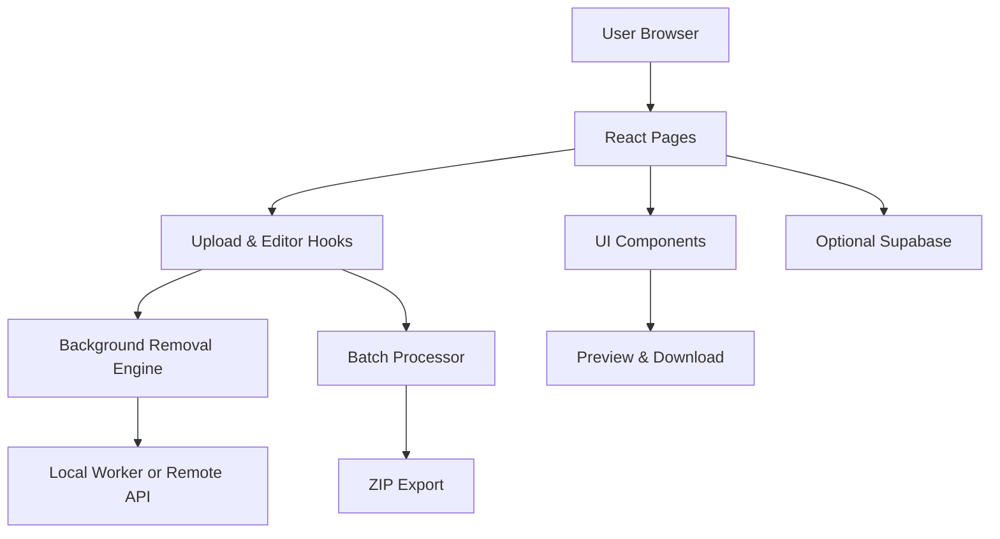

# Snap Background


Snap Background is a modern frontend app for removing image backgrounds, editing results, and exporting processed images. It provides single-image and batch workflows, a preview editor, and optional cloud history persistence.

---

## 📋 Table of Contents

- [About](#about)
- [Key Features](#key-features)
- [System Architecture](#system-architecture)
- [Tech Stack](#tech-stack)
- [Getting Started](#getting-started)
- [Environment Variables](#environment-variables)
- [Available Scripts](#available-scripts)
- [Project Structure](#project-structure)
- [Deployment](#deployment)
- [Contributing](#contributing)
- [License](#license)

---

## 🎯 About

Snap Background helps users remove image backgrounds, apply simple edits, and download results with transparent backgrounds. It focuses on a fast, responsive UI with features suitable for both casual users and small batch workflows.

### Overview

- Upload single or multiple images
- Remove background using a local or remote processing engine (configurable)
- Basic editor: crop, rotate, brightness, contrast, blur, and replace background color or image
- Batch processing with progress and ZIP export
- Optional cloud history (Supabase) for authenticated users

---

## ✨ Key Features

- Background removal (single + batch)
- Preview modal with editing controls and export options
- ZIP export for batch-processed images
- History persistence (optional Supabase table)
- Clean responsive UI built with shadcn components and Tailwind

---

## 🏗️ System Architecture



Main layers:

- Pages: upload, dashboard, preview/editor
- Hooks: `useUploader`, `useEditor`, `useBatchProcessor`
- Services: processing engine adapter (local worker or remote API), optional Supabase persistence

---

## 🛠️ Tech Stack

- Vite + React + TypeScript
- Tailwind CSS + shadcn / Radix UI
- React Query (`@tanstack/react-query`) for server state
- `react-hook-form` + `zod` for forms & validation
- Vitest + Playwright for testing

---

## 🚀 Getting Started

### Prerequisites

- Node.js 18 or newer
- npm or Bun

### Install

```bash
npm install
# or
bun install
```

### Run locally

```bash
npm run dev
```

Open the local URL printed by Vite.

---

## 🔐 Environment Variables

Create a `.env` at the project root to enable optional features and remote processing:

```bash
# Optional background removal API (if using remote service)
VITE_BG_API_URL=https://api.example.com/remove-background
VITE_BG_API_KEY=your_api_key_here

# Optional Supabase (history persistence)
VITE_SUPABASE_URL=https://your-project.supabase.co
VITE_SUPABASE_ANON_KEY=your_supabase_anon_key
```

Notes:

- If `VITE_BG_API_URL`/`VITE_BG_API_KEY` are not provided, the app will use the built-in/local processing mode (if available).
- Supabase is optional; when provided, the app will persist image history for authenticated users.

---

## 🧰 Available Scripts

| Command | Description |
| --- | --- |
| `npm run dev` | Start the development server |
| `npm run build` | Build production bundle |
| `npm run build:dev` | Build using development mode |
| `npm run preview` | Preview production build locally |
| `npm run lint` | Run ESLint |
| `npm run test` | Run tests once (Vitest) |
| `npm run test:watch` | Run tests in watch mode |

---

## 📁 Project Structure

```text
snap-background/
├── public/
├── src/
│   ├── components/        # UI components (shadcn + Radix)
│   ├── hooks/             # useUploader, useEditor, useBatchProcessor
│   ├── lib/               # processing adapters, utils
│   ├── pages/             # Upload, Dashboard, Preview
│   └── main.tsx
├── .env.example
├── package.json
├── tailwind.config.ts
├── vite.config.ts
└── README.md
```

Important files:

- `src/lib/processingAdapter.ts` — abstracts local vs remote background removal
- `src/pages/UploadWorkspace.tsx` — main upload and processing UI
- `src/components/PreviewModal.tsx` — image editor and export UI

---

## 🚢 Deployment

This is a static app — deploy the `dist/` output to Vercel, Netlify, Cloudflare Pages, or Firebase Hosting.

### Build

```bash
npm run build
```

### Preview

```bash
npm run preview
```

Ensure SPA routing is configured to redirect unknown routes to `index.html`.

---

## 🤝 Contributing

1. Fork the repo
2. Create a branch
3. Run tests and linting
4. Open a PR with a clear description

Commit message examples: `feat:`, `fix:`, `docs:`, `refactor:`

---

## 📄 License

MIT

---

If you want, I can also:

- Add screenshots/GIFs and usage examples
- Create a `CONTRIBUTING.md` and `CODE_OF_CONDUCT.md`
- Add example `.env.example` with placeholders

Applied SmartYatra-style README template adapted for `Snap Background`.
```


